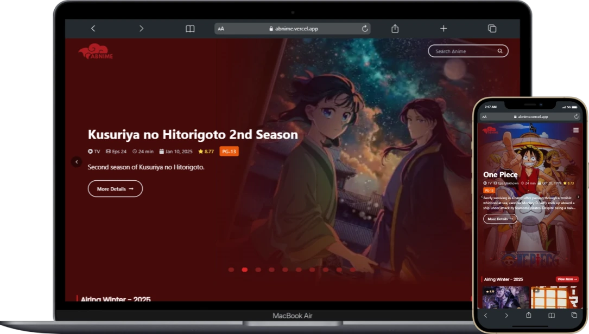
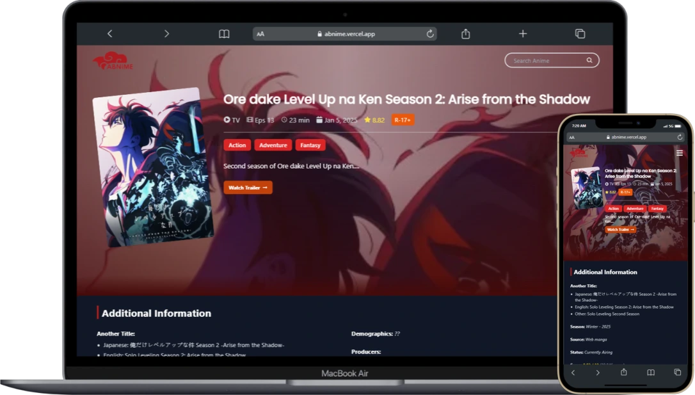

# 🍥 Abnime List

Welcome to **Abnime List**, a React application built using Vite, TailwindCSS, and Jikan API to provide a seamless anime browsing experience. This project is designed for anime enthusiasts who want quick access to anime information with a modern and responsive UI.

## 🚀 Features

- **Fast Performance**: Powered by Vite for lightning-fast development and build processes.
- **Responsive Design**: Designed with TailwindCSS for a fully responsive and mobile-friendly experience.
- **Dynamic UI**: Built with React and optimized for a smooth and interactive user experience.

## 🌐 Live Demo

Check out the live application here: [Abnime List](https://abnime.vercel.app/)

Experience the features and explore the anime list directly in your browser!

## 👌 API Reference

1. **API sources and documentation**

   ```bash
   https://jikan.moe
   ```

2. **BaseURL**
   ```bash
   https://api.jikan.moe/v4
   ```

## 🛠 Installation

### Prerequisites

Ensure you have the following installed on your system:

- [Node.js](https://nodejs.org/) (LTS version recommended)
- [npm](https://www.npmjs.com/) or [yarn](https://yarnpkg.com/)

### Steps

1. **Clone the repository**:

   ```bash
   git clone https://github.com/AbuDzarAlGhifari/abnime-list.git
   cd abnime-list
   ```

2. **Install dependencies**:

   ```bash
   npm install
   ```

3. **Start the development server**:

   ```bash
   npm run dev
   ```

4. **Open the app**:

   The app will be running at [http://localhost:5173](http://localhost:5173).

## 🖥 Screenshots

### Home Page



### Detail Page



## 💥 Dependencies

### List of Libraries and Packages Used

- **framer-motion**: For creating smooth and professional animations.
- **axios**: For making API requests and handling asynchronous data fetching.
- **@tanstack/react-query**: For managing server-state and simplifying data fetching, caching, and synchronization.
- **react-slick**: A React library for creating responsive and customizable sliders.
- **react-icons**: A library of popular and customizable icons for React applications.
- **tailwindcss**: A utility-first CSS framework for building responsive and modern designs effortlessly.
